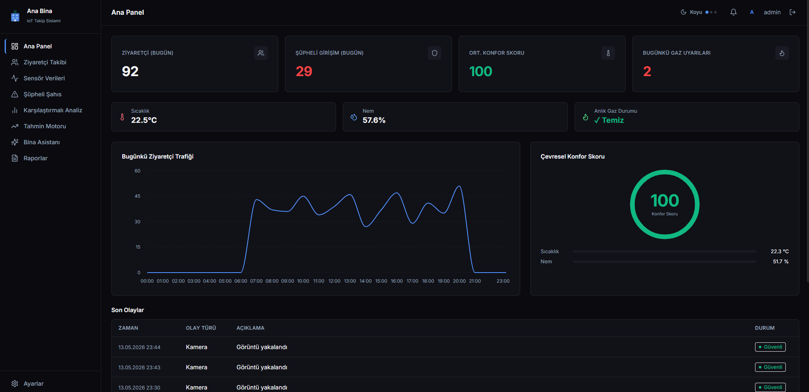
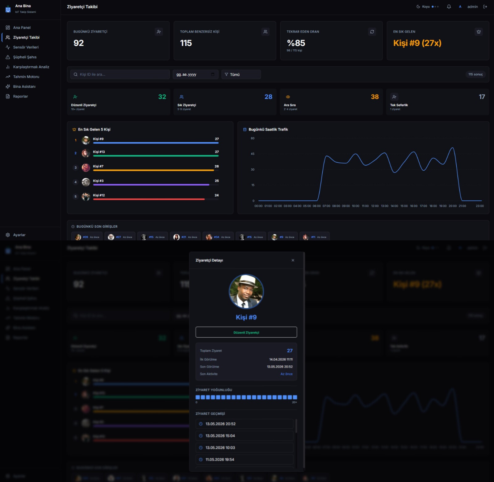
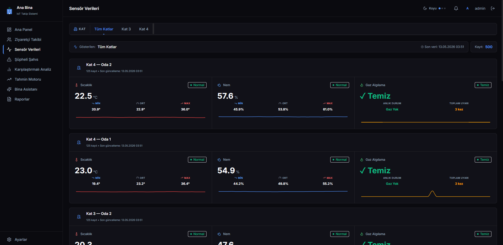
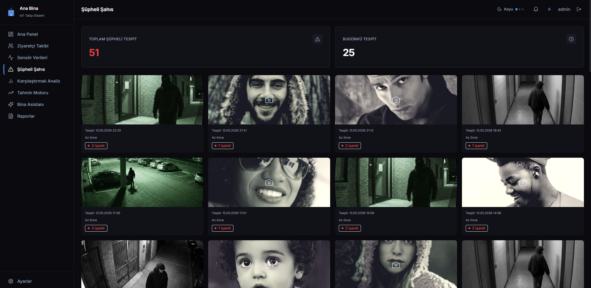
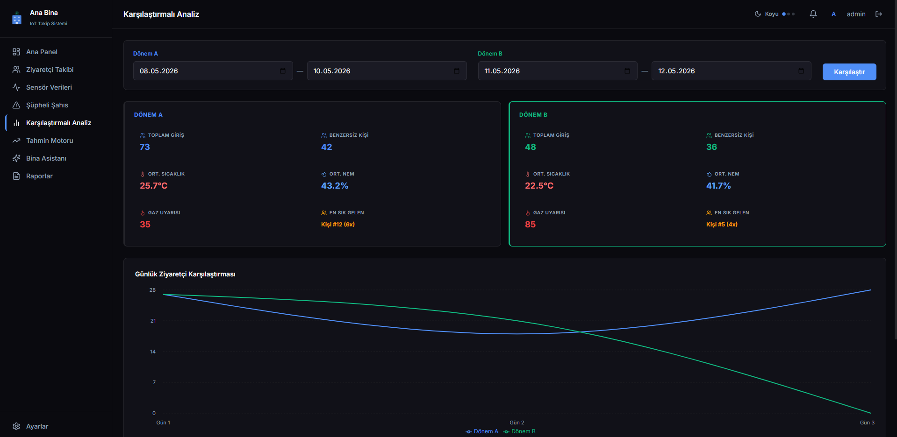
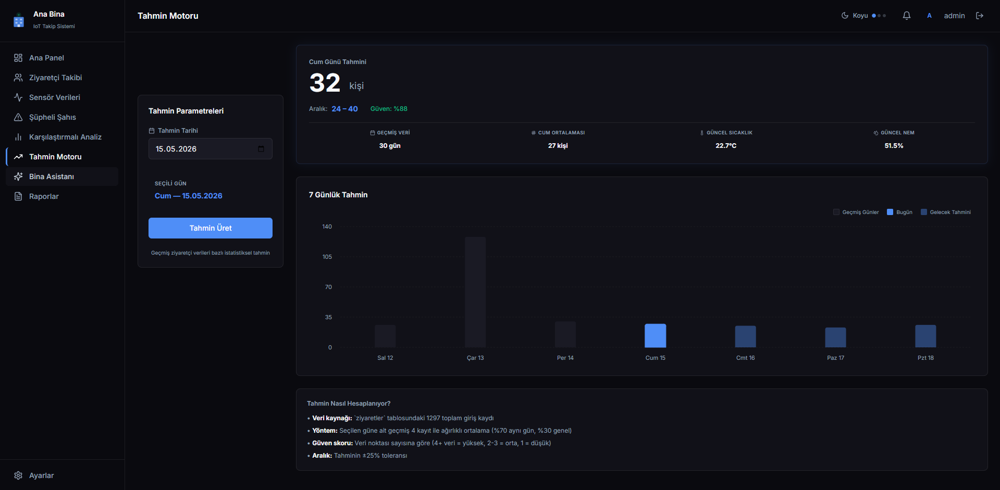
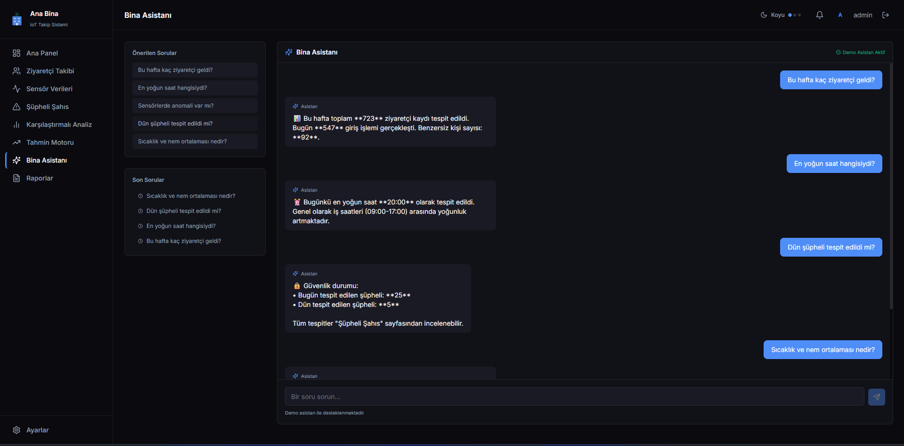
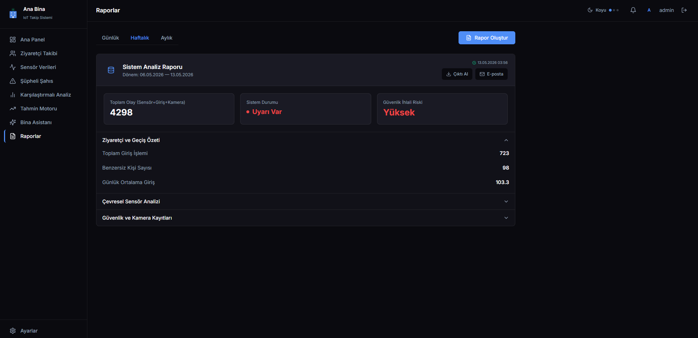

# 🏢 Ana Bina IoT Takip Sistemi

Gelişmiş yüz tanıma algoritmaları, gerçek zamanlı sensör veri analizi ve yapay zeka destekli bina yönetimi sunan kapsamlı bir **IoT Akıllı Bina Takip Sistemi**. Bu proje, fiziksel mekanların güvenliğini sağlamak, ziyaretçi trafiğini analiz etmek ve çevresel konforu optimize etmek için tasarlanmıştır.

---

## 🚀 Proje Hakkında

Sistem, binalardaki giriş-çıkışları akıllı kameralar ve yüz tanıma teknolojisi ile anlık olarak takip eder. Düzenli ziyaretçileri tanır, şüpheli şahısları anında tespit eder ve güvenlik uyarıları oluşturur.Bu proje kapsamında iki adet Raspberry Pi kullanıldı. Bir Raspberry iç güvenliği sağlar giriş çıkışları takip eder. Diğeri ise dış güvenliği sağlar. Kamera açısından belirli zaman diliminde çıkmakayan şahısları şüpheli şahıs olarak kayıt eder. Eş zamanlı olarak ESP32 tabanlı sensör ağlarından (sıcaklık, nem, gaz) gelen verileri işleyerek çevresel konfor skorunu hesaplar. Toplanan tüm bu büyük veri, makine öğrenmesi destekli tahmin motorları ve yapay zeka asistanı ile analiz edilerek yöneticilere sunulur.

## ✨ Temel Özellikler ve Modüller

### 1. 📊 Ana Panel (Dashboard)
Tüm sistemin kuş bakışı izlendiği kontrol merkezidir.
* Günlük ziyaretçi sayısı, şüpheli girişler, çevresel konfor skoru ve gaz uyarılarının anlık takibi.
* Ziyaretçi trafiğinin saatlik çizgi grafiği.
* Kameralardan gelen son olayların ve durumların listelenmesi.
* **Ekran Görüntüsü:**
  

### 2. 👥 Ziyaretçi Takibi ve Yüz Tanıma
Python ve Supabase entegrasyonu ile çalışan gelişmiş ziyaretçi analiz modülü.
* Tekil ziyaretçi sayımı, tekrar eden ziyaret oranları ve en sık gelen kişilerin tespiti.
* Ziyaretçileri "Düzenli", "Sık", "Ara Sıra" ve "Tek Seferlik" olarak otomatik kategorize etme.
* Bireysel ziyaretçi profilleri, ziyaret yoğunluğu ısı haritası ve geçmiş giriş logları.
* **Ekran Görüntüsü:**
  

### 3. 🌡️ Sensör Verileri (IoT Entegrasyonu)
ESP32 düğümlerinden gelen verilerin izlenmesi.
* Kat ve oda bazlı sıcaklık ve nem takibi (Min, Ort, Max değerler).
* Anlık gaz algılama durumu ve toplam uyarı sayıları.
* **Ekran Görüntüsü:**
  

### 4. ⚠️ Şüpheli Şahıs Tespiti
Kamera açısından belirli zaman dilinde gözükenler veya kara listede olan kişilerin anlık tespiti.
* Şüpheli şahıs logları ve yakalanan anlık kamera görüntüleri.
* **Ekran Görüntüsü:**
  

### 5. 📈 Karşılaştırmalı Analiz
Seçilen iki farklı tarih aralığının (Dönem A ve Dönem B) veriye dayalı kıyaslaması.
* Toplam giriş, benzersiz kişi, ortalama sıcaklık/nem ve gaz uyarılarının karşılaştırması.
* Trendleri ve anormallikleri tespit etmek için grafiksel gösterim.
* **Ekran Görüntüsü:**
  

### 6. 🔮 Tahmin Motoru (Makine Öğrenmesi)
Geçmiş verilere dayanarak gelecekteki ziyaretçi trafiğini tahmin eden istatistiksel motor.
* Belirli bir gün için beklenen ziyaretçi sayısı, güven skoru ve tolerans aralığı.
* Hava durumu, geçmiş 30 günlük veriler ve haftanın günü gibi parametrelerle ağırlıklı hesaplama.
* **Ekran Görüntüsü:**
  

### 7. 🤖 Bina Asistanı (Yapay Zeka Chatbot)
Yöneticilerin sistem verilerini doğal dil işleme (NLP) ile sorgulayabildiği asistan.
* *"Bu hafta kaç ziyaretçi geldi?"*, *"Dün şüpheli tespit edildi mi?"* gibi sorulara anlık, veriye dayalı yanıtlar.
* **Ekran Görüntüsü:**
  

### 8. 📄 Gelişmiş Raporlama
Sistem verilerinin günlük, haftalık ve aylık periyotlarda dışa aktarılması.
* Toplam olay sayısı, sistem güvenlik ihlali risk analizleri ve çevresel özetler.
* PDF formatında çıktı alma veya e-posta ile otomatik gönderim.
* **Ekran Görüntüsü:**
  

---

## 🛠️ Kullanılan Teknolojiler

* **Donanım:** Raspberry Pi 3B+ (Ana Sunucu / Edge Computing), ESP32 (Sensör Düğümleri)
* **Backend & Veri İşleme:** Python (Yüz tanıma ve veri analizi işlemleri için)
* **Veritabanı & Gerçek Zamanlı Depolama:** Supabase
* **Frontend:**  React.js, Tailwind CSS, Vite
* **Algoritmalar:** Yüz tanıma (Face Recognition API), Tahmin Algoritmaları (Ağırlıklı Ortalama)
